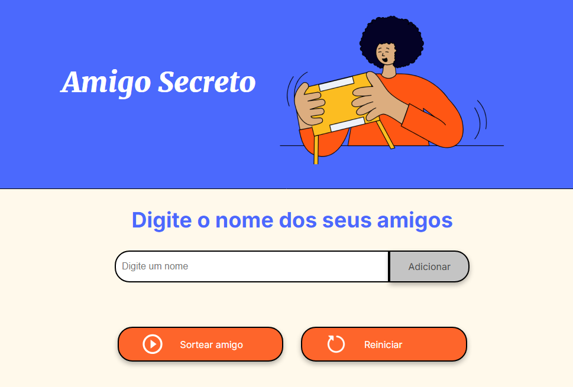
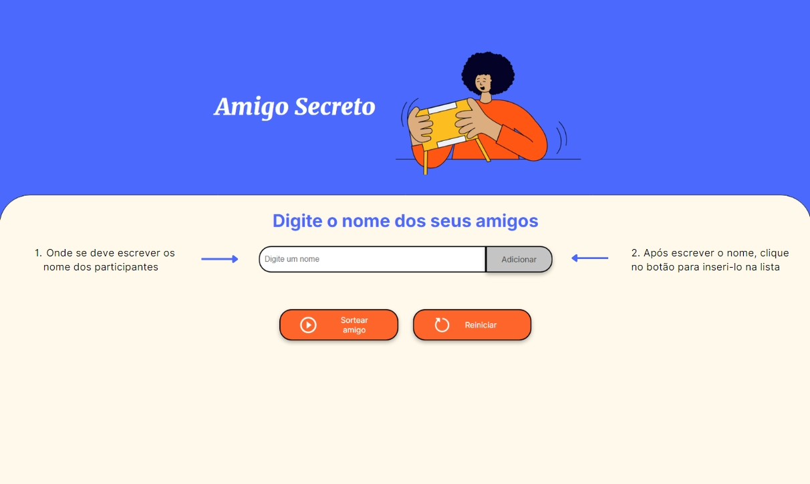
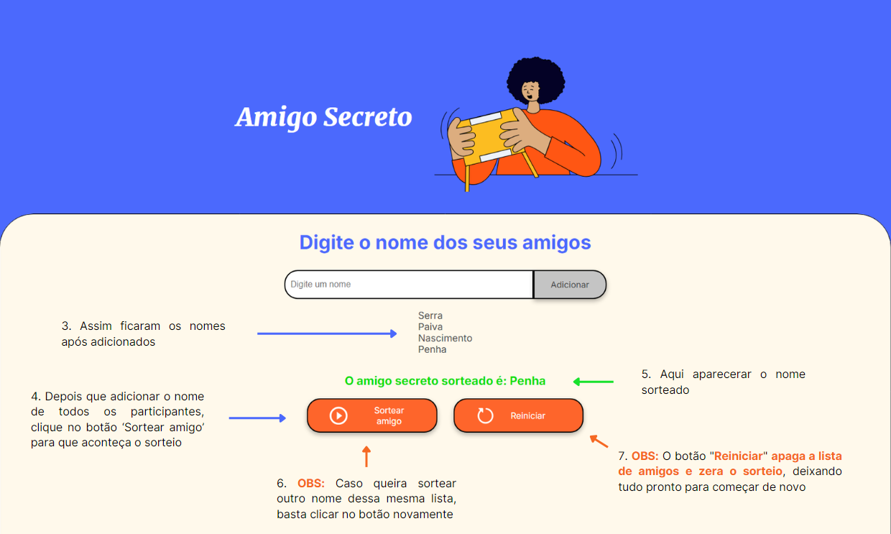

<h1 align="center">
   🎁 Challenge Amigo Secreto — Oracle Next Education (ONE)
</h1>

<p align="center">
  
  
  
  
</p>

Repositório dedicado à resolução do **Challenge Amigo Secreto**, o primeiro desafio prático de desenvolvimento de software proposto pela trilha inicial de lógica de programação do programa **Oracle Next Education (ONE)**, realizado em parceria com a **Alura**.

A aplicação simula um gerenciador reativo de sorteios onde os usuários podem inserir uma lista de participantes e realizar a escolha aleatória de um "amigo secreto" de forma automatizada.

<p align="center">
  
</p>

---

## 📌 Regras de Negócio & Engenharia de Lógica

O motor do sistema (estruturado puramente em `app.js`) foi arquitetado para tratar erros de entrada de dados e gerenciar o estado da interface visual através das seguintes operações:

* **Validação de Entrada Estrita:** Impede a inserção de strings vazias ou espaços em branco na lista. Caso o usuário tente clicar no botão de adicionar sem preencher o campo, o sistema dispara um alerta nativo de aviso.
* **Manipulação de Arrays (Persistência em Memória):** Cada nome válido é capturado via DOM, inserido em um array dinâmico (`amigos`) e o input de texto é limpo imediatamente para otimizar a usabilidade.
* **Renderização Dinâmica de Elementos HTML:** Uma função iteradora percorre o array a cada atualização, limpa o nó anterior do DOM e cria novos elementos de lista (`<li>`) injetados diretamente na tag correspondente, exibindo os nomes cadastrados em tempo real.
* **Algoritmo de Sorteio Aleatório:** Utilizando funções matemáticas nativas (`Math.random()` combinado com `Math.floor()`), o sistema sorteia um índice baseado no tamanho atual da lista. Uma validação prévia garante que o sorteio só ocorra se houver participantes cadastrados.

<p align="center">
  
  
</p>

---

## 📂 Organização dos Arquivos

```text
challenge-amigo-secreto
├── assets/             # Componentes de design, ícones e ilustrações da interface
├── app.js              # Camada lógica pura (orquestração do DOM, arrays e sorteio)
├── index.html          # Marcação estrutural e semântica do layout
└── style.css           # Tokens visuais, tipografias e estilização responsiva

```

---

## 🚀 Como Executar o Projeto

Por se tratar de uma aplicação front-end client-side pura, ela roda de forma nativa no navegador sem necessidade de ferramentas de terminal ou servidores backend:

1. Realize o clone deste repositório em sua máquina:
```bash
git clone https://github.com/cassia-nascimento/challenge-amigo-secreto.git

```


2. Acesse a pasta do projeto:
```bash
cd challenge-amigo-secreto

```


3. Abra o arquivo `index.html` diretamente em qualquer navegador web de sua preferência (Chrome, Firefox, Safari ou Edge).

---

## 👩‍💻 Autora

Desafio construído e documentado com foco em boas práticas por **Cássia Nascimento**.

* [GitHub Profile](https://github.com/cassia-nascimento)
* [LinkedIn](https://www.linkedin.com/in/cassia--nascimento/)
